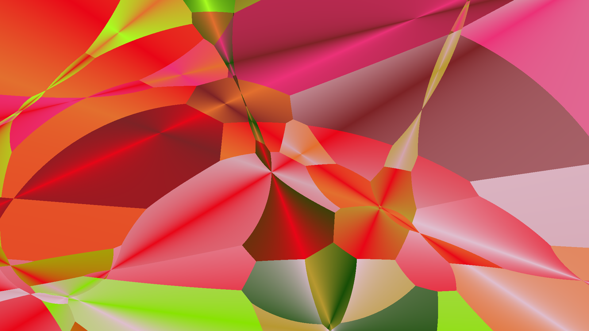
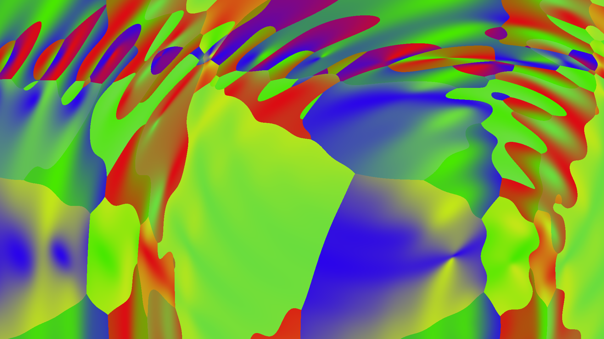
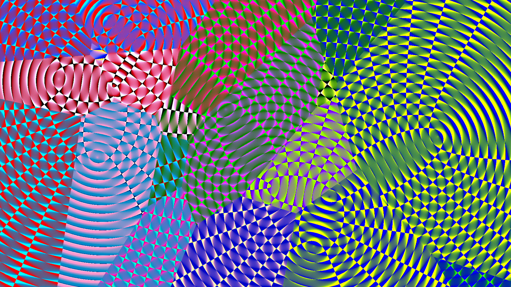
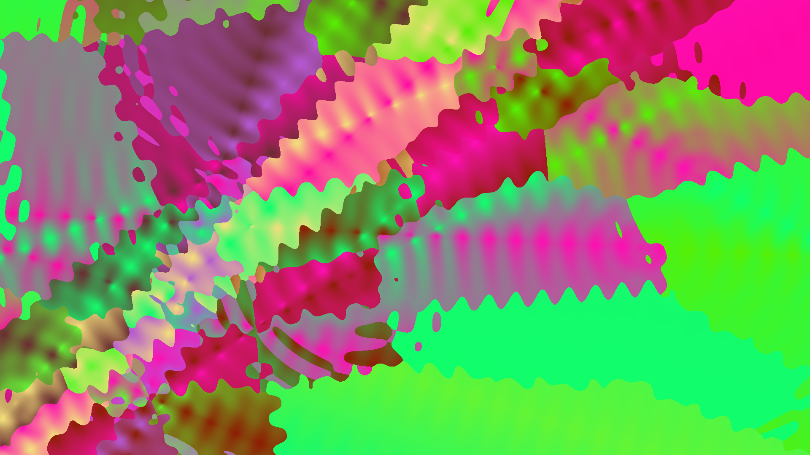
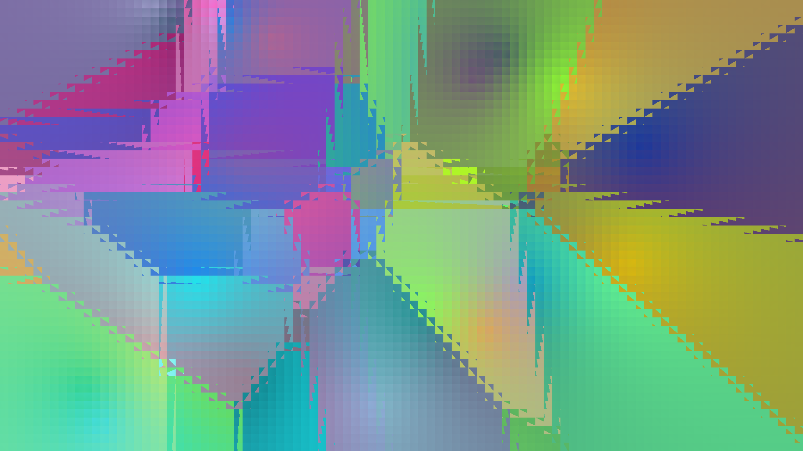
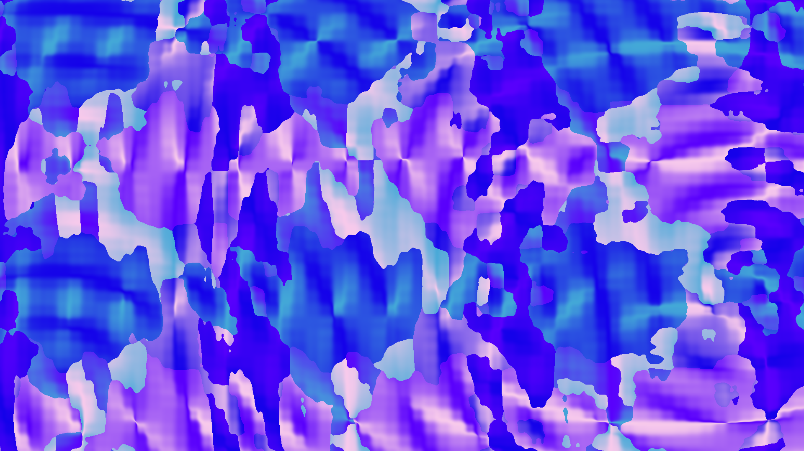
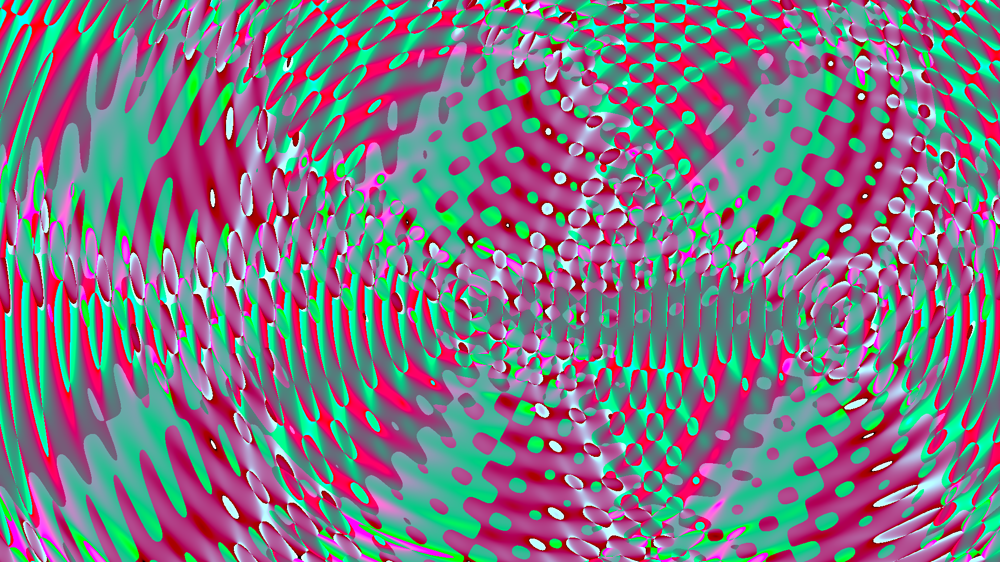
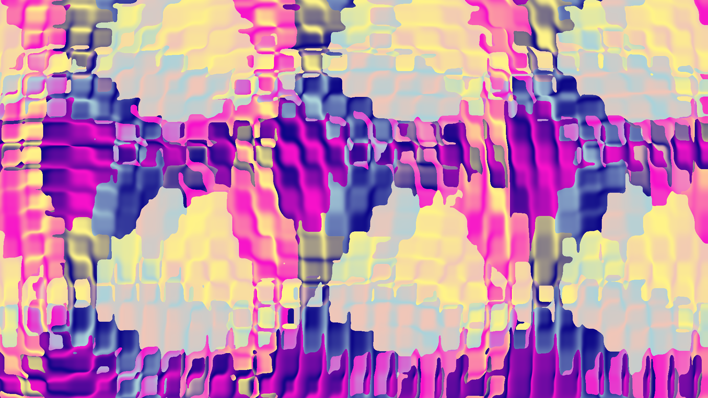
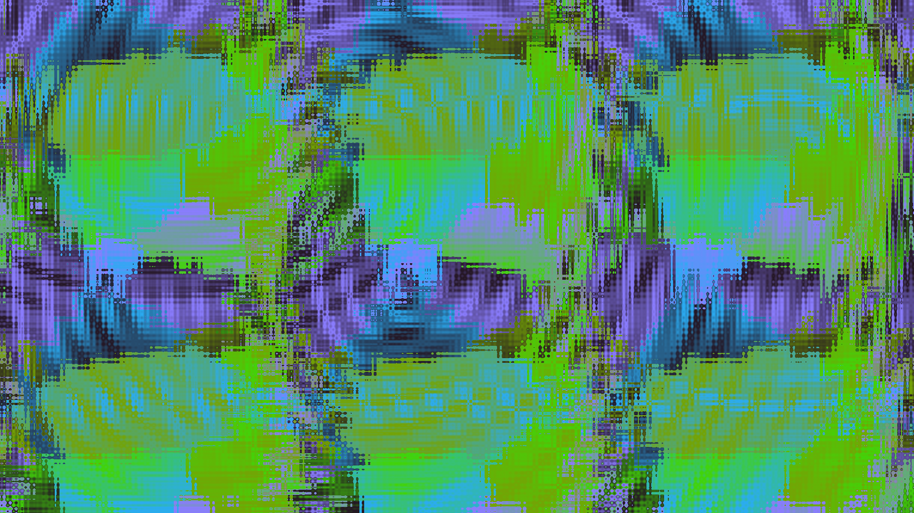

# galaxy-garden-2

An improved version of galaxy-garden that uses opengl instead of opencv.
This has a dependency on glfw3, tclap, and opencv.

See `gg2 --help` for a basic idea of how to use it.

## Examples
`gg2 -e 'angle' -I pics/angles.png -w 1920x1080 -r 121`

`gg2 -e '(cos((gl_FragCoord.xy+point)/200)+vec2(1,1)).x * (sin((gl_FragCoord.xy+point)/200)+vec2(1,1)).y + psin(dist/20+time)*0.05' -s 0.001 -a 2 -r 0.1 -R 1 -m 1x1 -n 5 -I long_command.png -w 1920x1080`

`gg2 -v 'sin(dist/10)' -e dist -I pics/sort_not_rank.png -w 1920x1080`

`gg2 -e 'sin(dist/10*cos(dist/102))' -I pics/testing.png -w 1920x1080`

`gg2 -e '20*(sin(dist/10)+1)+angle*dist' -w 1920x1080 -I pics/thing.png`

`gg2 -p 'fg = fg + 100*sin(fg);' -s 0.001 -a 3 -n 20 -e 'dist' -y none -g 9x9 -I pics/prerun_example.png -w 1920x1080`

`gg2 -p 'fg = fg - 2*mod(fg,20);' -s 0.001 -a 3 -n 20 -e 'dist' -y none -I pics/prerun_2.png -w 1920x1080`

`gg2 -e '(cos((gl_FragCoord.xy+point)/100)+vec2(1,1)).x * (sin((gl_FragCoord.xy+point)/100)+vec2(1,1)).y + psin(dist/20)*0.5' -s 0.001 -a 2 -n 4 -p 'fg = fg - 1*cos(fg/5)*5;' -I pics/no_clue_what_to_name_these.png -w 1920x1080`

`gg2 -E -e 'vec2 e=pcos((fg.xy+point)/100); return e.x*e.y+sin(dist/10);' -s 0.001 -a 2 -n 3 -I pics/blob.png -w 1920x1080`

`gg2 -E -e 'vec2 e=pcos((fg.xy+point)/100); return e.x*e.y+psin(dist/10)*0.2;' -p 'fg += 10*sin(fg/10);' -s 0.001 -a 2 -n 5 -w 1920x1080 -I pics/didntexpecthisbutsure.png`

`gg2 -E -e 'vec2 e=pcos((fg.xy+point)/100); return e.x*e.y+psin(dist/10)*0.2;' -p 'fg += 10*sin(fg/2);' -s 0.001 -a 2 -n 5 -I pics/what_i_was_actually_going_for.png -w 1920x1080`

